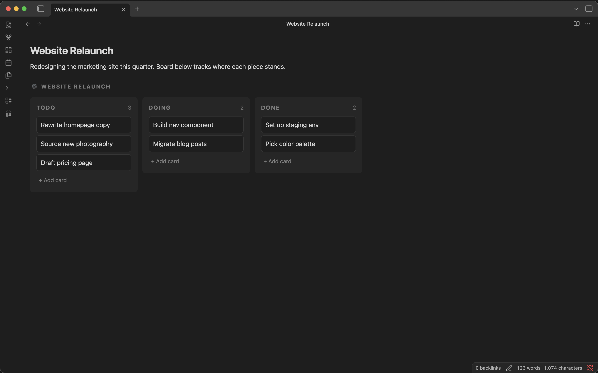
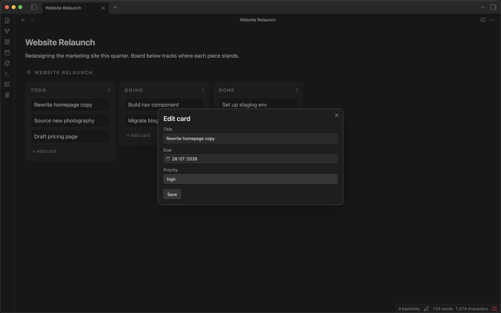
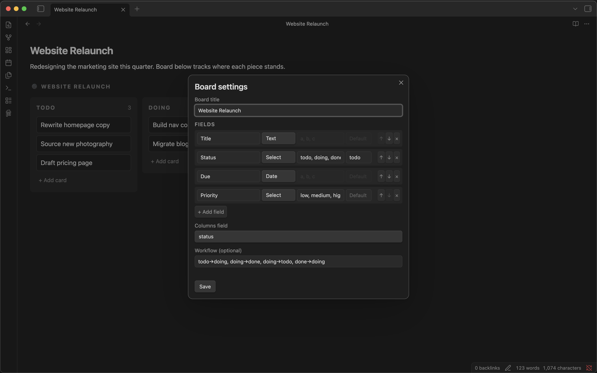
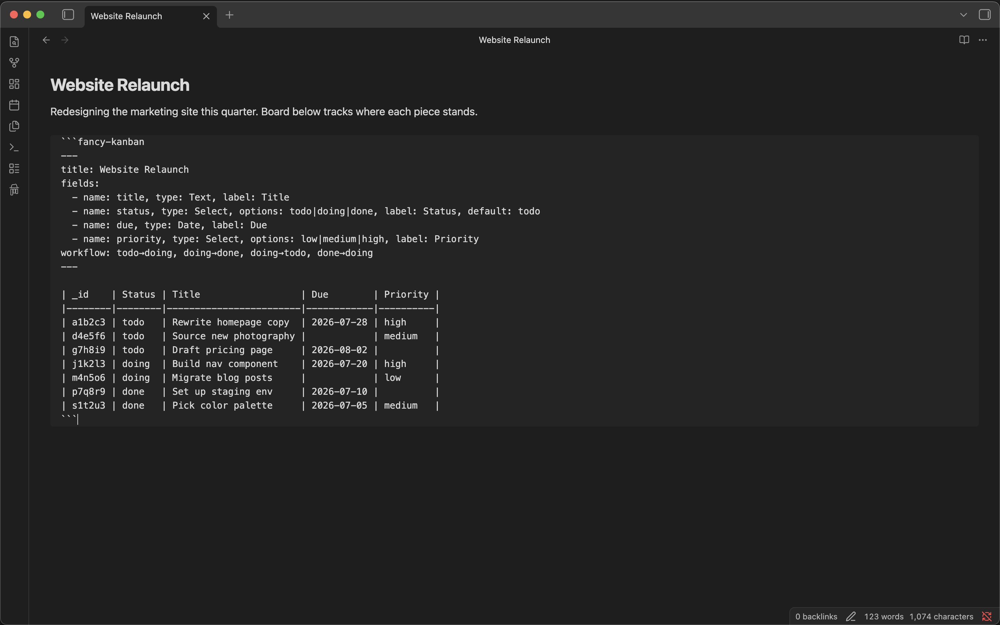

<p align="center">  </p>

# Fancy Kanban

Kanban that finally lives where your notes do.



## Why

I kept bouncing off every kanban plugin I tried. They lived in their own tab, cut off from the note I actually cared about — and honestly, the UI looked stuck in 1999. I could build something better. That's how I started Fancy Kanban. Here it is — you be the judge.

## Features

- **Boards embedded directly in notes** — no separate view required, boards render inline alongside your other content
- **Relational card data** — define custom fields (text, long text, date, number, select, file) per board, not just a title and a list of tags
- **Drag-and-drop** — reorder cards within and across columns, with workflow validation
- **Card editor** — a dedicated modal for viewing and editing every field on a card
- **Standalone board view** — open a board in its own pane via the ribbon icon or command palette, in addition to inline embedding
- **Board setup panel** — create and edit fields, columns, and workflow through a dedicated UI, no hand-editing the config block required
- **Human-readable format** — boards are stored as a fenced code block containing a config section and a standard Markdown table, so the data is still readable (as a table) even without the plugin installed

## Installation

**From within Obsidian:**

1. Go to Settings → Community plugins → Browse
2. Search for **Fancy Kanban**
3. Click Install, then Enable

## Usage

### Create a board

- Run **Fancy Kanban: New board** from the command palette, or
- Click the Fancy Kanban ribbon icon

This inserts a `fancy-kanban` code block into your note (or opens one in a standalone view), pre-populated with a starter config and an empty table. From there, open the **board setup** panel to add or edit fields, columns, and workflow — no need to hand-edit the config block unless you want to.



### Edit a board

- Add, move, and reorder cards directly on the rendered board
- Click a card to open the card editor, where every field on that card is editable
- The underlying table updates automatically as you work — your note's Markdown source stays in sync with the board



### The data format

Each board is a fenced code block — here's the board above, as it actually looks in the note's source:




````markdown
```fancy-kanban
---
title: Website Relaunch
fields:
  - name: title, type: Text, label: Title
  - name: status, type: Select, options: todo|doing|done, label: Status, default: todo
  - name: due, type: Date, label: Due
  - name: priority, type: Select, options: low|medium|high, label: Priority
workflow: todo→doing, doing→done, doing→todo, done→doing
---

| _id    | Status | Title                  | Due        | Priority |
|--------|--------|------------------------|------------|----------|
| a1b2c3 | todo   | Rewrite homepage copy  | 2026-07-28 | high     |
| d4e5f6 | todo   | Source new photography |            | medium   |
| g7h8i9 | todo   | Draft pricing page     | 2026-08-02 |          |
| j1k2l3 | doing  | Build nav component    | 2026-07-20 | high     |
| m4n5o6 | doing  | Migrate blog posts     |            | low      |
| p7q8r9 | done   | Set up staging env     | 2026-07-10 |          |
| s1t2u3 | done   | Pick color palette     | 2026-07-05 | medium   |
```
````

Because it's a standard Markdown table under the hood, a board is still legible — as a table, without interactivity — in any Markdown viewer, even without the plugin.

## Roadmap

Fancy Kanban is early. In rough order:

- [ ] **Import from `obsidian-kanban`** — bring existing boards over without manually rebuilding them
- [ ] **Swimlanes** — a `lanes` field as a second grouping dimension over the same table

If there's a gap you'd like prioritized, [open an issue](https://claude.ai/issues) — this roadmap takes real usage and feedback into account.

## Acknowledgements

Thanks to [mgmeyers](https://github.com/mgmeyers) for `obsidian-kanban`, and to the Obsidian community for the feedback and reactions that helped shape this project's direction.

## License

[MIT](https://claude.ai/chat/LICENSE) — Copyright (c) 2026 Astuten.io Ltd

---

[](https://github.com/robertoallende/fancy-kanban/actions/workflows/ci.yml)
[](https://codecov.io/github/robertoallende/fancy-kanban)
[](https://claude.ai/chat/LICENSE)


