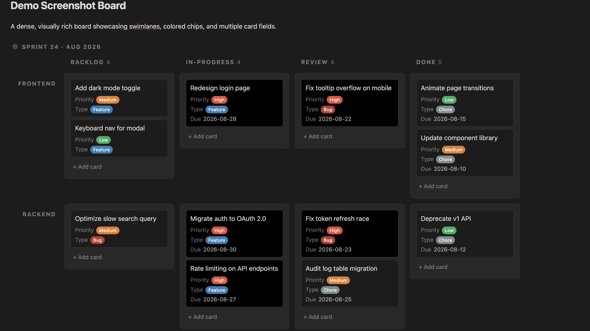
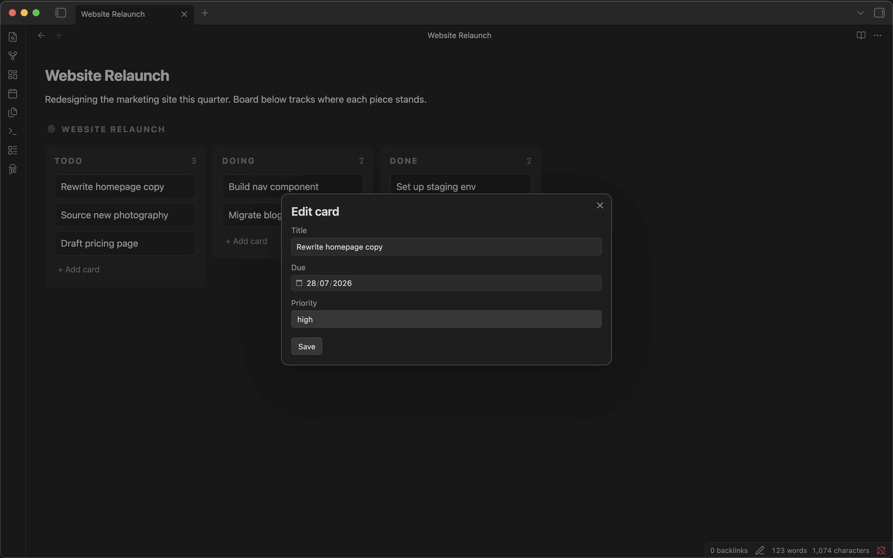
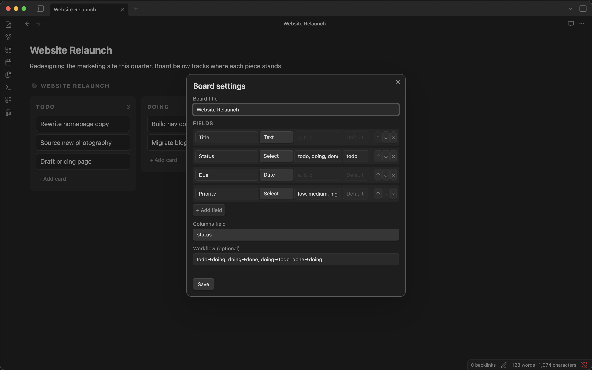
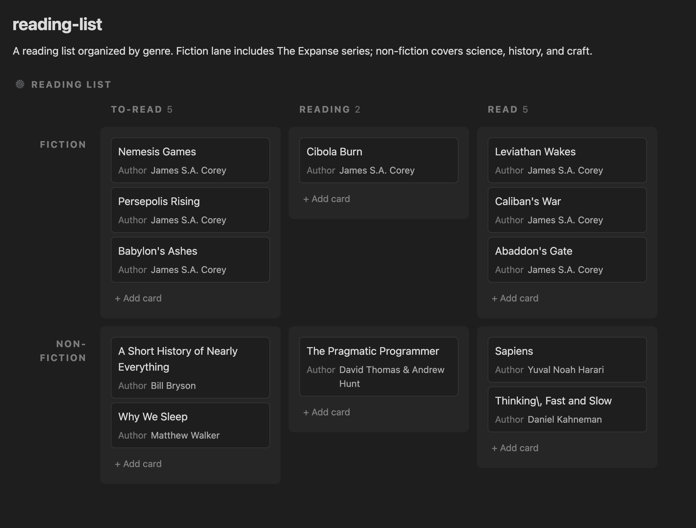
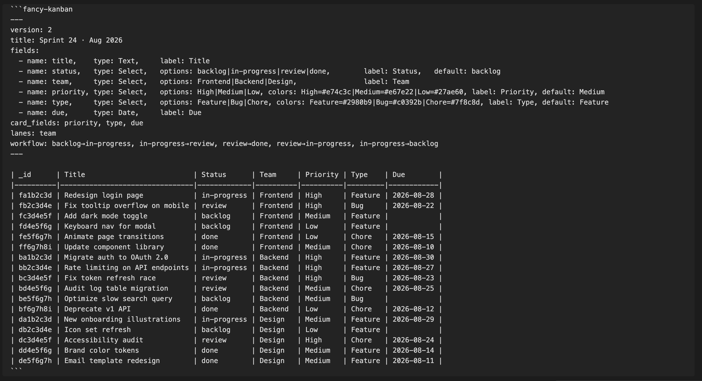

<p align="center">  </p>

# Fancy Kanban

Kanban that finally lives where your notes do.



## Why

I kept bouncing off every kanban plugin I tried. They lived in their own tab, cut off from the note I actually cared about — and honestly, the UI looked stuck in 1999. I could build something better. That's how I started Fancy Kanban. Here it is — you be the judge.

## Features

- **Boards embedded directly in notes** — no separate view required, boards render inline alongside your other content
- **Relational card data** — define custom fields (text, long text, date, number, select, file) per board, not just a title and a list of tags
- **Drag-and-drop** — reorder cards within and across columns, with workflow validation
- **Card editor** — a dedicated modal for viewing and editing every field on a card
- **Standalone board view** — open a board in its own pane via the ribbon icon or command palette, in addition to inline embedding
- **Board setup panel** — create and edit fields, columns, and workflow through a dedicated UI, no hand-editing the config block required
- **Human-readable format** — boards are stored as a fenced code block containing a config section and a standard Markdown table, so the data is still readable (as a table) even without the plugin installed
- **Swimlanes** — add a second grouping dimension with `lanes: <field>` in the board config; cards are arranged in a grid of columns × lanes, and dragging a card across a lane row updates both fields at once
- **Import from Obsidian Kanban** — bring existing `obsidian-kanban` boards over with one command; lanes become columns, cards and their notes are preserved, inline metadata (dates, tags) is stripped cleanly

## Installation

**From within Obsidian:**

1. Go to Settings → Community plugins → Browse
2. Search for **Fancy Kanban**
3. Click Install, then Enable

## Usage

### Create a board

- Run **Fancy Kanban: New board** from the command palette, or
- Click the Fancy Kanban ribbon icon

This inserts a `fancy-kanban` code block into your note (or opens one in a standalone view), pre-populated with a starter config and an empty table. From there, open the **board setup** panel to add or edit fields, columns, and workflow — no need to hand-edit the config block unless you want to.



### Edit a board

- Add, move, and reorder cards directly on the rendered board
- Click a card to open the card editor, where every field on that card is editable
- The underlying table updates automatically as you work — your note's Markdown source stays in sync with the board



### Import from Obsidian Kanban

If you have existing boards created with the [Obsidian Kanban plugin](https://github.com/mgmeyers/obsidian-kanban), you can bring them into Fancy Kanban in one step:

1. Open the `.md` file of an Obsidian Kanban board
2. Run **Fancy Kanban: Import from Obsidian Kanban** from the command palette
3. A new file `<original-name>-fk.md` is created in the same folder and opened automatically

The original file is not modified. Each lane becomes a status column, card titles are preserved (dates, tags, block IDs, and wiki-links are stripped), and any multi-line card body becomes a `description` field on the card.

### Swimlanes

Add `lanes: <field>` to the board config to group cards by a second Select field. The board renders as a grid — column headers across the top, lane labels on the left. Dragging a card to a different lane row updates both the column and the lane field in the same operation.


````markdown
```fancy-kanban
lanes: genre
```
````

Any `Select` field can be the swimlane field. You can also set it through the board settings panel — no hand-editing required.

### The data format

Each board is a fenced code block — here's the board above, as it actually looks in the note's source:




````markdown
```fancy-kanban
---
version: 2
title: Sprint 24 · Aug 2026
fields:
  - name: title,    type: Text,     label: Title
  - name: status,   type: Select,   options: backlog|in-progress|review|done,        label: Status,   default: backlog
  - name: team,     type: Select,   options: Frontend|Backend|Design,                label: Team
  - name: priority, type: Select,   options: High|Medium|Low, colors: High=#e74c3c|Medium=#e67e22|Low=#27ae60, label: Priority, default: Medium
  - name: type,     type: Select,   options: Feature|Bug|Chore, colors: Feature=#2980b9|Bug=#c0392b|Chore=#7f8c8d, label: Type, default: Feature
  - name: due,      type: Date,     label: Due
card_fields: priority, type, due
lanes: team
workflow: backlog→in-progress, in-progress→review, review→done, review→in-progress, in-progress→backlog
---

| _id      | Title                          | Status      | Team     | Priority | Type    | Due        |
|----------|--------------------------------|-------------|----------|----------|---------|------------|
| fa1b2c3d | Redesign login page            | in-progress | Frontend | High     | Feature | 2026-08-28 |
| fb2c3d4e | Fix tooltip overflow on mobile | review      | Frontend | High     | Bug     | 2026-08-22 |
| fc3d4e5f | Add dark mode toggle           | backlog     | Frontend | Medium   | Feature |            |
| ba1b2c3d | Migrate auth to OAuth 2.0      | in-progress | Backend  | High     | Feature | 2026-08-30 |
| bc3d4e5f | Fix token refresh race         | review      | Backend  | High     | Bug     | 2026-08-23 |
| be5f6g7h | Optimize slow search query     | backlog     | Backend  | Medium   | Bug     |            |
| da1b2c3d | New onboarding illustrations   | in-progress | Design   | Medium   | Feature | 2026-08-29 |
| dc3d4e5f | Accessibility audit            | review      | Design   | High     | Chore   | 2026-08-24 |
| db2c3d4e | Icon set refresh               | backlog     | Design   | Low      | Feature |            |
```
````

Because it's a standard Markdown table under the hood, a board is still legible — as a table, without interactivity — in any Markdown viewer, even without the plugin.

### Generate boards with AI

If you use an agentic AI coding tool — Claude Code, Kiro, Codex, Pi, or any of the [75+ supported agents](https://skills.sh) — you can install the Fancy Kanban skill and ask it to generate boards for you directly in your vault.

```bash
npx skills add robertoallende/fancy-kanban
```

Once installed, your AI assistant knows the full board schema: field types, config keys, workflow syntax, swimlanes, escaping rules, and the correct markdown table format. You can prompt it naturally:

- *"Create a software project board with backlog, in-progress, review, and done columns, grouped by team"*
- *"Add a priority Select field with High, Medium, and Low options to this board"*
- *"Generate a content pipeline board with idea, draft, review, and published statuses"*

The AI writes a valid `fancy-kanban` block directly into your note, ready to render with the plugin.

## Feature Requests and Issues

If there's a gap you'd like prioritized, [open an issue](https://github.com/robertoallende/fancy-kanban/issues) — this roadmap takes real usage and feedback into account.

## Acknowledgements

Thanks to [mgmeyers](https://github.com/mgmeyers) for `obsidian-kanban`, and to the Obsidian community for the feedback and reactions that helped shape this project's direction.

## License

[MIT](https://github.com/robertoallende/fancy-kanban/blob/main/LICENSE) — Copyright (c) 2026 Astuten.io Ltd

---

[](https://github.com/robertoallende/fancy-kanban/actions/workflows/ci.yml)
[](https://codecov.io/github/robertoallende/fancy-kanban)
[](https://claude.ai/chat/LICENSE)


